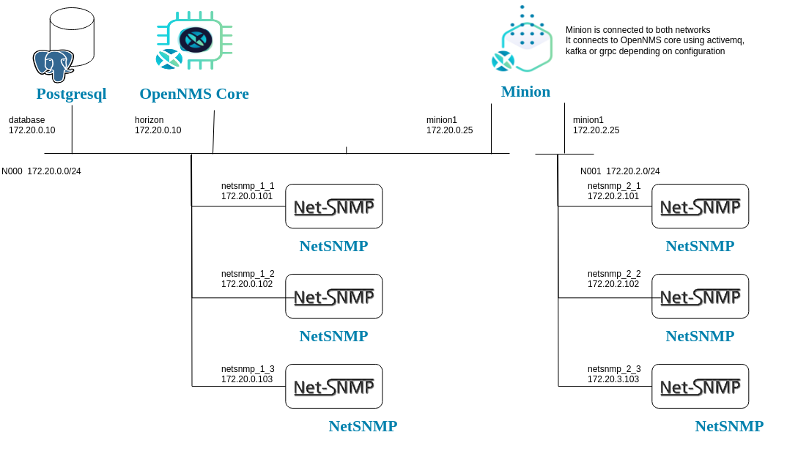

# Exercise 1-1 

[Main Menu](../README.md) | [Session 1](../session1/README.md) | [Exercise-1-1](../session1/Exercise-1-1.md)

## Getting started with A Docker Compose Project

All of the examples in this set of tutorials use docker compose to create an OpenNMS system and also to simulate networks or servers which we wish to manage.

The first tutorial example use the docker compose project in the folder [minimal-minion-activemq](../session1/minimal-minion-activemq)

The  [docker-compose.yaml](../session1/minimal-minion-activemq/docker-compose.yaml) file configures an opennms horizon with its database, an opennms minion and six test servers running netsnmp.

The configurations for each of the containers are held in separate folders under the [container-fs](../session1/minimal-minion-activemq/container-fs) folder

We will look at OpenNMS configuration in detail as we move forwards, but In this first example, we simply want to get OpenNMS running and scanning a simple network.

You should have already installed docker and docker compose. 
Open a terminal (or power-shell in windows) and navigate to the first example project folder and issue the following commands.

```
cd minimal-minion-activemq
docker compose up -d
```
You should see a large number of images downloading and eventually all of the services starting.
The `-d` is important as it makes the example run as a daemon in the background once it is started.

Once started, you will see output like:

```
Network minimal-minion-activemq_N000               Created
Network minimal-minion-activemq_N001               Created
Volume "minimal-minion-activemq_data-opennms"      Created
Volume "minimal-minion-activemq_data-opennms-cfg"  Created
Volume "minimal-minion-activemq_data-postgres"     Created
Container database                                 Started
Container horizon                                  Started
Container minion1                                  Started
Container netsnmp_1_2                              Started                                                                                        Container netsnmp_1_1                              Started
Container netsnmp_2_1                              Started                                                                                                                                                                          Container netsnmp_2_2                              Started
```
Since this is the first time running, OpenNMS horizon will create and populate it's database. 
This will take some time but you can watch the process by following the horizon logs as the system boots

```
docker compose logs -f horizon
```
A long listing will happen until you see something like

```
horizon  | [INFO] Invocation start successful for MBean OpenNMS:Name=KarafStartupMonitor
horizon  | [INFO] Invoking start on object OpenNMS:Name=Telemetryd
horizon  | [INFO] Invocation start successful for MBean OpenNMS:Name=Telemetryd
horizon  | [INFO] Invoking start on object OpenNMS:Name=Trapd
horizon  | [INFO] Invocation start successful for MBean OpenNMS:Name=Trapd
horizon  | [INFO] Invoking start on object OpenNMS:Name=PerspectivePoller
horizon  | [INFO] Invocation start successful for MBean OpenNMS:Name=PerspectivePoller
```
At which point, OpenNMS has booted correctly.

You should now be able to browse to the OpenNMS terminal on

http://localhost/opennms

or possibly if running docker desktop in windows with IPv6

http://[::1]:8980/opennms

Login with 
```
username: admin 
password admin
```
(on a production system you should change the admin password on first log in)

When you have finished, you should shutdown with 
```
docker compose down
```
This will preserve the database volume for when you next boot OpenNMS

If you want to delete the database and start OpenNMS from scratch use
```
docker compose down -v
```

## Example network

The docker compose example defines an example network illustrated in the following image



