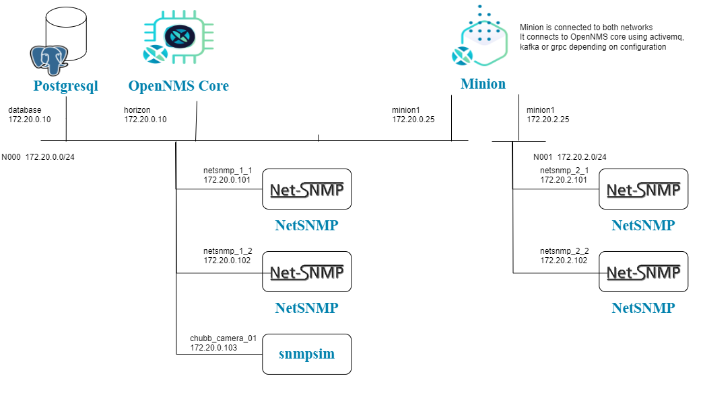

# Exercise 2-1 

[Main Menu](../README.md) | [Session 2](../session2/README.md) | [Exercise-2-1](../session1/Exercise-2-1.md)

The docker compose [docker-compose.yaml](../session2/minimal-minion-activemq/docker-compose.yaml) example creates an example network illustrated in the following image

