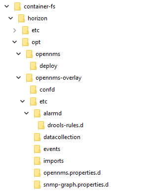

# Session 2 OpenNMS Configuration

[Main Menu](../README.md) | [Session 2](../session2/README.md)

## Contents
1. OpenNMS Configuration Overview
* opennms configuration directories
* configuring a docker image
1. OpenNMS Events and Alarms and Traps
* basic events alarms and traps
* parsing a mib and creating an event configuration

## OpenNMS Configuration Overview

In older OpenNMS courses, we encouraged people to edit the configuration files directly in an OpenNMS system running on a virtual machine.
This worked well but it was inconvenient to have to modify the configuration for each example exercise.

In this course, it is much more convenient to provide examples using docker where the modified configuration files are simply overlaid on the default configuration files provided in the docker image. 
Please note, however that all of the examples will work equally well in a standard installation or a container installation of OpenNMS.
The cinfiguration files being modified are exactly the same.

Before we proceed it is important to understand the main directory locations in an OpenNMS installation and how these are mapped to the example docker compose projects which use OpenNMS docker containers.
The following figure shows the folders in a typical OpenNMS installation installed on a Linux system using a package manager.
 

An RPM based installation  (RHEL, Rocky Linux, Centos etc) will follow this exact pattern .

An APT based installation (Debian, Ubuntu etc)  follows the same pattern but instead of real folders, it follows the Debian directory practices and uses symbolic links to the etc, logs and share directories.

OpenNMS Docker containers follow a similar pattern.
(Earlier containers were based on Centos but later containers have used Ubuntu as the based image).

However you need to follow some conventions when overlaying configuration files on an OpenNMS container.
This is because, when the conteiner starts

opennms configuration locations
opennms etc directory
opennms configuration in containers

Provisioning  requisitions
netsim container
SNMP Community strings

exercise 1
note docker compose down -v first

## Events, Alarms and Traps
Node down node up events and traps
Node down node up alarms

Exercise - happiness alarm
happines alarm
event from trap
event from UI
event from ReST / Rester

Exercise - parsing a mib for events and creating alarms - chubb mib

[root@netsnmp_1_1 /]# snmpwalk -v 2c -On -c chubb chubb_camera_01
.1.3.6.1.2.1.1.1.0 = STRING: M1 (TUNNEL) 0/2L
.1.3.6.1.2.1.1.2.0 = OID: .1.3.6.1.4.1.52330.1.6
.1.3.6.1.2.1.1.3.0 = Timeticks: (404669) 1:07:26.69
.1.3.6.1.2.1.1.4.0 = STRING: Highways England - 03001235000
.1.3.6.1.2.1.1.5.0 = STRING: 00021,20002
.1.3.6.1.2.1.1.6.0 = STRING: 0002L
[root@netsnmp_1_1 /]# snmpwalk -v 2c -On -c public chubb_camera_01

RUN echo "deb http://archive.debian.org/debian stretch main" > /etc/apt/sources.list

