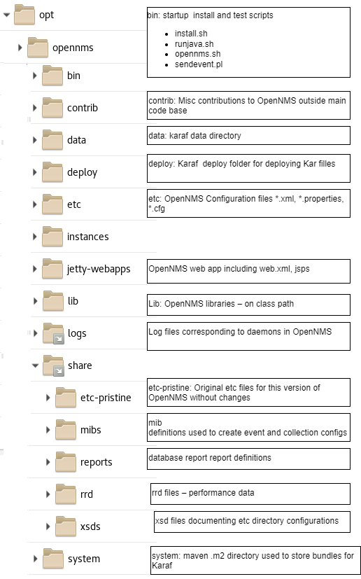

# Session 2 OpenNMS Configuration

[Main Menu](../README.md) | [Session 2](../session2/README.md)

## Contents
1. OpenNMS Configuration Overview
* opennms configuration directories
* configuring a docker image
2. OpenNMS Events and Alarms and Traps
* basic events alarms and traps
* parsing a mib and creating an event configuration


## OpenNMS Configuration Overview

In older OpenNMS courses, we encouraged people to edit the configuration files directly in an OpenNMS system running on a virtual machine.
This worked well but it was inconvenient to have to modify the configuration for each example exercise.

In this course, it is much more convenient to provide examples using docker where the modified configuration files are simply overlaid on the default configuration files provided in the docker image. 
Please note, however that all of the examples will work equally well in a standard installation or a container installation of OpenNMS.
The configuration files being modified are exactly the same.

Before we proceed it is important to understand the main directory locations in an OpenNMS installation and how these are mapped to the example docker compose projects which use OpenNMS docker containers.
The following figure shows the folders in a typical OpenNMS installation installed on a Linux system using a package manager.
 


An RPM based installation  (RHEL, Rocky Linux, Centos etc) will follow this exact pattern .

An APT based installation (Debian, Ubuntu etc)  follows the same pattern but instead of real folders, it follows the Debian directory practices of using symbolic links to the etc, logs and share directories.

All of the configuration files are held in the `/opt/opennms/etc/` directory.

The `/opt/opennms/share/etc-pristine` directory always holds the untouched original configuration files shipped with any particular OpenNMS distribution. 
This always allows you to compare any changes with the default state.

In a non-containerised install, we advise users to version control the `/opt/opennms/etc/` directory so that you can track all changes made locally. 
A simple but effective approach to this is to turn the `/opt/opennms/etc/` directory into a git repository and base line on the untouched files. 
You can do this using the following commands:

```
cd /opt/opennms/etc/
git init
git tag -a v1.0 -m 'Initial base configuration of OpenNMS 32.0.4'
```
After this, you can commit, tag and annotate any further changes you make.

In containerised installs, you should version control the configurations injected into the container.
You will need to make sure that the files you are overlaying are baselined against the version of OpeNNMS in the selected container otherwise the system may not start.
We will talk about updating an installation in a later module.

The `/opt/opennms/share/xsds` directory contains the XML Schema Definitions for the xml files. 
These xsd definitions are generated from the jaxb annotated code during the build of OpenNMS and provide detailed documentation for all of the fields in the xml configuration files.

---
**NOTE**

For these tutorials, we have provided a folder of untouched xml configurations and associated xsds in [pristine-opennms-config-files](../../main/pristine-opennms-config-files/)
You can copy and modify these as you need to in the docker compose configuration overlays.

---

## Docker Container File Mapping

OpenNMS Docker containers follow a similar pattern to the standard Linux installations, with earlier containers based on Centos and later containers using Ubuntu as the based image. 

However it is not enough just to overwrite the default container directories as the containers have been designed for easy configuration using environment variables and you need to follow additional conventions when injecting configuration files into an OpenNMS container.

### Environment variables and confd

OpenNMS containers use [confd](https://github.com/kelseyhightower/confd/tree/master) templates to create some etc configurations on startup based on injected environment variables and templates. 

The following environment variables can be injected to the container, but if they are not specified in the docker-compose.yml scripts, the shown defaults are used.
(This is why the variables are not always specified in the examples).

```
    environment:
      TZ: 'America/New_York'(4)
      POSTGRES_HOST: 'database'(5)
      POSTGRES_PORT: 5432
      POSTGRES_USER: 'postgres'
      POSTGRES_PASSWORD: 'postgres'
      OPENNMS_DBNAME: 'opennms'
      OPENNMS_DBUSER: 'opennms'
      OPENNMS_DBPASS: 'opennms'
```
These particular database settings set values in the file [/etc/opennms-datasources.xml](../../main/pristine-opennms-config-files/etc-pristine/opennms-datasources.xml)

If you overlay `opennms-datasources.xml`, the environment variables will not be applied on container start.

The minion containers use an injected configuration file [/opt/minion/minion-config.yaml](../session2/minimal-minion-activemq/container-fs/minion1/opt/minion/minion-config.yaml) to set up the internal minion /etc/*.cfg properties.

### Overlay Configuration Files 

Secondly, on startup, OpenNMS core containers copy any files in `/opt/opennms-overlay/` and replace the default files in `/opt/opennms/etc/`

So in all of the examples, the relevant files are modified in the docker compose project and injected into the container `/opt/opennms-overlay/` so that they will be copied to the `/opt/opennms/etc` folder before OpenNMS starts.

Finally, you should note that any OpenNMS Plugins can be injected into an OpenNMS instance before start up by copying the plugin files into the `/container-fs/horizon/opt/opennms/deploy` directory which maps to the karaf deploy directory within OpenNMS.

We needed to cover this introduction to configuration file locations so that you understand how the examples relate to your production OpenNMS installation. 
We will have a lot more to say about configuration as we proceed with the course.

## Provisioning Requisitions

In [Session 2](../session2/README.md) we looked at how OpenNMS can scan a network and add any devices it discovers. 

OpenNMS uses reverse DNS to make a good guess for each node name and sets up the device to be monitored in a reasonable way.
If a node has SNMP running on port 162, OpenNMS use the default SNMP `public` community strings to request information from the node. 

In many cases, however, users already know what devices and service they have and it is important to name and apply metadata or categories to these devices in a consistent way which aligns with their network inventory. 
Often it is also important for security to use secret SNMP community strings to communicate with the nodes.

In [Exercise2-1](../session2/Exercise2-1.md) we will look at how device information and SNMP community strings can be provisioned in OpenNMS.


## Events, Alarms and Traps

OpenNMS is an event driven system.
This means that the many processes running in OpenNMS primarily communicate with each other using OpenNMS events. 
OpenNMS internal events correspond to changes of state within the system. 
Example of these you will have already seen are events surrounding the discovery of new devices or the import of requisitions.
Other examples would be node down events where OpenNMS cannot communicate with a device threshold crossing events where the system has detected that a collected value has crossed a user set threshold.

Events may also be externally generated from devices using standard event protocols communicating with OpenNMS through the network; for example SNMP traps or SYSLOGS.
Finally, it is also possible to directly inject events into OpenNMS using the ReST API.

The majority of events are also persisted in the OpenNMS event table and may then be searched and viewed through the UI.
However it is also possible to not persist certain events when they are only used for inter-process communication.

Events tell us something happened at a certain point of time but they don't record the current state of a system.
Often devices will repeatedly send multiple events (traps or logs) when they have detected a problem. 
This can lead to an 'Event Storm' where it is very hard for a user to deal with so many incoming events.

OpenNMS uses Alarms to correlate events into a current state which makes it much easier to see what the current status of a device, service or network is. 
Some events may raise an alarm and some events may cause an alarm to clear. 
Each alarm will maintain count and a list of events contributing to the alarm state. 


In [Exercise2-2](../session2/Exercise2-2.md) we will do some simple examples inject traps into OpenNMS.

In [Exercise2-3](../session2/Exercise2-3.md) we will do some simple examples to help explain how  OpenNNMS traps and alarms are configured.

In the next [Session 3](../session3/README.md) we will consolidate our learning with a more complex example which imports events from an SNMP MIB.
