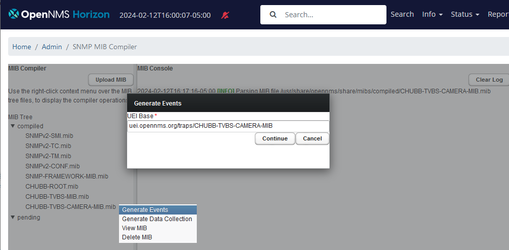

# Session 3

[Main Menu](../README.md) | [Session 3](../session3/README.md)

## Introduction

In [Session 2](../session2/README.md) we saw how to create an event and alarm definition using an unformatted OpenNMS event from an unknown trap.
In this session we will do a worked example using the manufactures published SNMP MIBS.


Road side cameras are used to provide surveillance for [smart motorways](https://www.highwaysmagazine.co.uk/chubb-launches-new-camera-system-for-smart-motorways/6703) and CHUBB, who manufacture these cameras, have published a MIB for camera event traps sent from their camera control system. 
In this example we will import this MIB into OpenNMS and create camera alarms.

## Getting started
In this example we will use the same network as we used in [Session 2](../session2/README.md). 

However we want to start with a clean system because instead of creating the configuration files inside the container, we will inject them using docker. 

Use the new [session3/minimal-minion-activemq](../session3/minimal-minion-activemq/) project.

```
# make sure the old database and configuration is gone by deleting the volumes using the -v option
cd minimal-minion-activemq
docker compose down -v

# restart opennms
docker compose up -d

# follow the logs until OpennMS is up.
# this will take a while because we are recreating the database
docker compose logs -f horizon

# OpenNMS will be up around when you see the logs reach
horizon  | [INFO] Invoking start on object OpenNMS:Name=PerspectivePoller
horizon  | [INFO] Invocation start successful for MBean OpenNMS:Name=PerspectivePoller

# Ctrl-c to exit

```
Once OpenNMS is running, open a session at http:\\localhost:8980 (username: admin password: admin)

The provided test-network1-requisition now has two cameras

| container | Native SNMP port | Host Exposed SNMP Port | internal ip address | node label | foreign id |
| --------- | ---------------- | ---------------------- | ------------------- | ---------- | ---------- |
| chubb_camera_01 | 161        | 11561                  | 172.20.0.103        | chubb_camera_01 | chubb_camera_01 |
| chubb_camera_02 | 161        | 11661                  | 172.20.2.103        | chubb_camera_02 | chubb_camera_02 |

You will need to import the test-network1-requisition and add the `chubb` snmp community string for chubb_camera_02 and chubb_camera_02 as covered in [Exercise-2-1](../session1/Exercise-2-1.md)

You should now have the full test network including the cameras ready for you to design the configuration.

Log into both cameras and check you can walk the mib locally

```
docker compose exec chubb_camera_01 bash

# check that snmpsim is working when you walk the MIB
 snmpwalk -v 2c -On -c chubb localhost
.1.3.6.1.2.1.1.1.0 = STRING: M1 (TUNNEL) 0/2L
.1.3.6.1.2.1.1.2.0 = OID: .1.3.6.1.4.1.52330.1.6
.1.3.6.1.2.1.1.3.0 = Timeticks: (404669) 1:07:26.69
.1.3.6.1.2.1.1.4.0 = STRING: Highways England - 03001235000
.1.3.6.1.2.1.1.5.0 = STRING: 00021,20002
.1.3.6.1.2.1.1.6.0 = STRING: 0002L
```

Ping horizon to make sure you can see it 

```
ping horizon

```

Try sending the following trap from chubb_camera_01 to horizon using netsnmp.
You should see an unformatted event from chubb_camera_01 in the OpenNMS event list.

```
# send a trap

snmptrap -v 2c -c public horizon:1162 ""  .1.3.6.1.4.1.52330.6.2.0.1  .1.3.6.1.4.1.52330.6.2.7.0  s xxxx   .1.3.6.1.4.1.52330.6.2.1.0 i 0  .1.3.6.1.4.1.52330.6.2.5.0 i 1
```
Do the same for chubb_camera_02 but this time send the trap to minion1

```
docker compose exec chubb_camera_02 bash

ping minion1

# send a trap

snmptrap -v 2c -c public minion1:1162 ""  .1.3.6.1.4.1.52330.6.2.0.1  .1.3.6.1.4.1.52330.6.2.7.0  s xxxx   .1.3.6.1.4.1.52330.6.2.1.0 i 0  .1.3.6.1.4.1.52330.6.2.5.0 i 1
```

If you are receiving unformatted events in OpenNMS, your connectivity is working fine and we are ready to format the traps.

## Parsing a MIB

OpenNMS provides a web based tool to read SNMP mibs and generate configurations. 
The Web UI is functional but a bit limited in scope within a container a so will be better off generating the configuration files from the UI and then editing them outside the container.

To open the Mib compiler go to the Admin Page (Cogs) and select Additional Tools > SNMP MIB Compiler.

You can see there is a button labelled `Upload MIB` which allows us to upload any mib files into OpenNMS for processing

All of the MIB files we will need are in the folder 

[session3/minimal-minion-activemq/container-fs/snmpsim/mibs](../session3/minimal-minion-activemq/container-fs/snmpsim/mibs)

The MIB file we will need to create our configuration is [CHUBB-TVBS-CAMERA.mib](../session3/minimal-minion-activemq/container-fs/snmpsim/mibs/CHUBB-TVBS-CAMERA.mib). 

Upload this file and right click on it and slelect `compile`.
You will get the following error:


If you examine the MIB file you will see that it requires definitions taken from other MIB files.

```
CHUBB-TVBS-CAMERA-MIB DEFINITIONS ::= BEGIN

IMPORTS
    chubb, products
        FROM CHUBB-ROOT
    MODULE-COMPLIANCE, NOTIFICATION-GROUP, OBJECT-GROUP
        FROM SNMPv2-CONF            -- RFC 2580
    Integer32, Unsigned32, MODULE-IDENTITY, NOTIFICATION-TYPE, OBJECT-TYPE
        FROM SNMPv2-SMI;            -- RFC 2578

...
```

So in order to use this MIB we must import its dependencies first and since each of the dependencies also requires other MIB files, you may have a bit of trial and error to upload and compile the files in the correct order.

Once you have upload and compiled all of the files, you will be in a position to generate the event definitions as shown here



We will keep the default base UEI definition as `uei.opennms.org/traps/CHUBB-TVBS-CAMERA-MIB`

If you select save event file, you will see from the log that a new event definition file has been created `CHUBB-TVBS-CAMERA-MIB.events.xml` containing 4 event definitions and a reference to this file has been placed in the `eventconf.xml` file

```
2024-02-12T16:29:00-05:00 [DEBUG] Normalizing event uei.opennms.org/traps/CHUBB-TVBS-CAMERA-MIB/healthChange
2024-02-12T16:29:00-05:00 [DEBUG] Normalizing event uei.opennms.org/traps/CHUBB-TVBS-CAMERA-MIB/tamperDetected
2024-02-12T16:29:00-05:00 [DEBUG] Normalizing event uei.opennms.org/traps/CHUBB-TVBS-CAMERA-MIB/logicInputChange
2024-02-12T16:29:00-05:00 [DEBUG] Normalizing event uei.opennms.org/traps/CHUBB-TVBS-CAMERA-MIB/commsStateChange
2024-02-12T16:29:00-05:00 [INFO] Saving XML data into /usr/share/opennms/etc/events/CHUBB-TVBS-CAMERA-MIB.events.xml
2024-02-12T16:29:00-05:00 [INFO] Adding a reference to events/CHUBB-TVBS-CAMERA-MIB.events.xml inside eventconf.xml.
2024-02-12T16:29:00-05:00 [INFO] Saving XML data into /usr/share/opennms/etc/eventconf.xml
2024-02-12T16:29:00-05:00 [INFO] The event's configuration reload operation is being performed.
```

OpenNMS should now be able to process the event we sent previously from the chubb_camera_01

```
docker compose exec chubb_camera_01 bash

snmptrap -v 2c -c public horizon:1162 ""  .1.3.6.1.4.1.52330.6.2.0.1  .1.3.6.1.4.1.52330.6.2.7.0  s xxxx   .1.3.6.1.4.1.52330.6.2.1.0 i 0  .1.3.6.1.4.1.52330.6.2.5.0 i 1
```

You should now see new events being generated in OpenNMS.

We need to extract the two event files we have generated so that we can mofdify and re-inject them as an overlay to the container.

We can copy the files into the local directory using the docker compose cp command

```
docker compose cp horizon:/usr/share/opennms/etc/events/CHUBB-TVBS-CAMERA-MIB.events.xml .

docker compose cp horizon:/usr/share/opennms/etc/eventconf.xml .

```
This will copy the files into the root of your project for you to work with.

Example copies of these files are also provided in the  [session3/minimal-minion-activemq/workup-config](../session3/minimal-minion-activemq/workup-config) folder'

