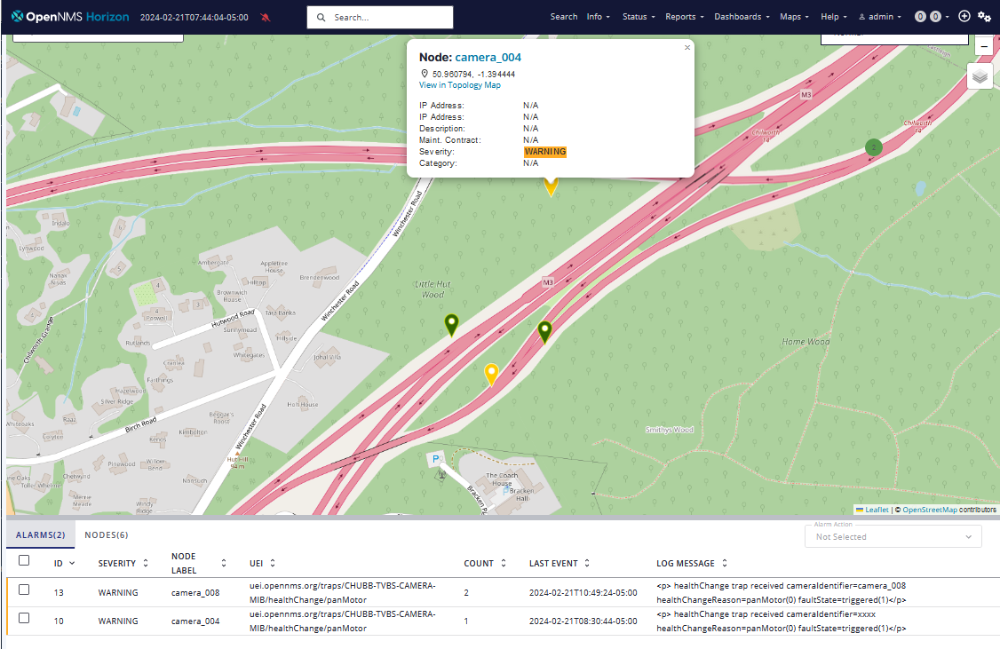

# Exercise 4-1 

[Main Menu](../README.md) | [Session 4](../session4/README.md) | [Exercise-4-1](../session4/Exercise-4-1.md)

In this exercise we will translate received traps into a set of modified traps using the [event translator](https://docs.opennms.com/horizon/33/operation/deep-dive/events/event-translator.html).

Imagine that multiple cameras from the examples in [Session 3](../session3/README.md) are controlled from a single `camera-controller`. 
The cameras themselves are not directly manageable from OpenNMS but the `camera-controller` monitors the cameras and will send traps to OpenNMS if it detects any problems with any of the cameras.

The operator wishes to show the status of all the cameras on a map, so they need to be represented as OpenNMS nodes which may or may not have alarms associated with them.

The cameras and camera controllers are defined in the [camera-locations.xml requisition](../session4/minimal-minion-activemq/container-fs/horizon/opt/opennms-overlay/etc/imports/camera-locations.xml).

You should import this requisition to define the cameras and `camera-controller` when you start OpenNMS.
The cameras are named after the fashion; camera_001, camera_002 etc. 
Each camera also has an asset record defining the latitude and longitude of its location which creates the following map;

The camera nodes are themselves not monitored by OpenNMS and do not have any interface definitions, so they are in effect `dummy nodes` which can have alarms associated with them. 

Each camera has a unique `cameraIdentifier` to identify it in the `camera-controller` and on OpenNMS.

The traps sent from the `camera-controller` follow exactly the same pattern as the traps in the previous exercise but they all have an extra string varbind which contains the cameraIdentifier.

Example traps are provided in [CAMERA-CONTROLLER Trap Examples](../session4/TrapExamplesCAMERA-CONTROLLER.md)

These traps match the event configuration here [etc/events/CAMERA-CONTROLLER-MIB.events.xml](../session4/minimal-minion-activemq/container-fs/horizon/opt/opennms-overlay/etc/events/CAMERA-CONTROLLER-MIB.events.xml) 

You need to design an event translator configuration which will translate the new traps into the old events with the correct nodeid corresponding to the `cameraIdentifier` in the traps.

A starting point is provided here [etc/translator-configuration.xml](../session4/minimal-minion-activemq/container-fs/horizon/opt/opennms-overlay/etc/translator-configuration.xml) 
This is based upon the standard translations included with OpenNMS. 
A starting point is provided the end of the file `Translations FOR CAMERA CONTROLLER EVENTS`.

You will find the answer here (but try the exercise first).
[Exercise-4-1 Answer](../session4/Exercise4-1-answer.md)
