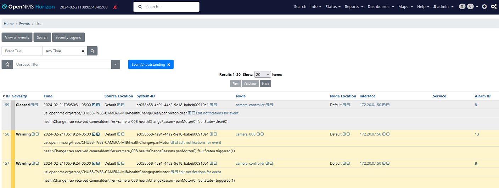

# Exercise 4-1 Answer

[Main Menu](../README.md) | [Session 4](../session4/README.md) | [Exercise-4-1 Answer](../session4/Exercise4-1-answer.md)

This is the answer to [Exercise-4-1](../session4/Exercise-4-1.md)

```
      <!-- Translations FOR CAMERA CONTROLLER EVENTS -->
      <event-translation-spec uei="uei.opennms.org/traps/CHUBB-TVBS-CAMERA-MIB/healthChange/panMotor">
         <mappings>
            <mapping preserve-snmp-data="false">
               <assignment name="nodeid" type="field">
                  <value type="sql" result="SELECT n.nodeid FROM node n  WHERE n.nodelabel = ? ">
                     <value type="parameter" name=".1.3.6.1.4.1.52330.6.2.7.0" matches=".*" result="${0}" />
                  </value>
               </assignment>
            </mapping>
         </mappings>
      </event-translation-spec>

      <event-translation-spec uei="uei.opennms.org/traps/CHUBB-TVBS-CAMERA-MIB/healthChangeClear/panMotor-clear">
         <mappings>
            <mapping preserve-snmp-data="false">
               <assignment name="nodeid" type="field">
                  <value type="sql" result="SELECT n.nodeid FROM node n  WHERE n.nodelabel = ? ">
                     <value type="parameter" name=".1.3.6.1.4.1.52330.6.2.7.0" matches=".*" result="${0}" />
                  </value>
               </assignment>
            </mapping>
         </mappings>
      </event-translation-spec>
      
```

---
**NOTE**
You will need to translate all of the required raise and clear traps. 
If a simple alarm configuration is adopted which uses the varbind paramameter within the reduction and clear keys, then only two translations would be needed. 

---

If you inject a trap, you will see two sets of events and alarms are generated.

```
#### panMotor raise
snmptrap -v 2c -c public horizon:1162 ""  .1.3.6.1.4.1.52330.6.2.0.1        .1.3.6.1.4.1.52330.6.2.7.0 s camera_008   .1.3.6.1.4.1.52330.6.2.1.0 i 0  .1.3.6.1.4.1.52330.6.2.5.0 i 1

#### panMotor clear
snmptrap -v 2c -c public horizon:1162 ""  .1.3.6.1.4.1.52330.6.2.0.1        .1.3.6.1.4.1.52330.6.2.7.0 s camera_008   .1.3.6.1.4.1.52330.6.2.1.0 i 0  .1.3.6.1.4.1.52330.6.2.5.0 i 0
```

Firstly an event is generated corresponding to the `camera-controller` and a second event is generated corresponding to the node label defined in the cameraIdentifier oid  `.1.3.6.1.4.1.52330.6.2.7.0 s camera_008`

Unfortunately, there is no simple way to avoid creating the `camera-controller` events.




